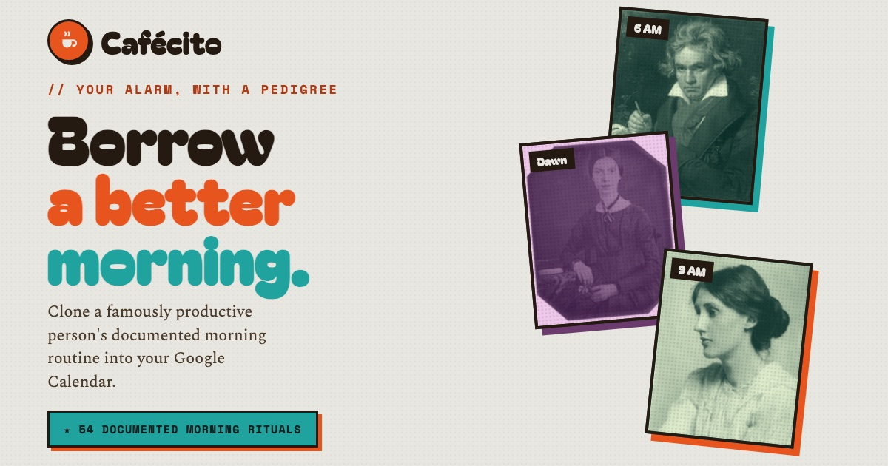

# ☕ Cafécito

Borrow a better morning. Pick a famously productive person (Beethoven, Maya Angelou, Kobe, Murakami…) and Cafécito drops their documented morning routine straight into your Google Calendar. Their wake hour, their coffee, their first hour. You just get up.

### → [cafecito.io](https://cafecito.io)

A silly thing I made on Claude design. One static page, no framework, no build step. 54 risers, each with a real sourced routine, a search and a wake-time filter, and a planner that slides the whole morning to whenever you actually get up.

Portraits and routines are credited in [CREDITS.md](CREDITS.md). Code is [MIT](LICENSE).
